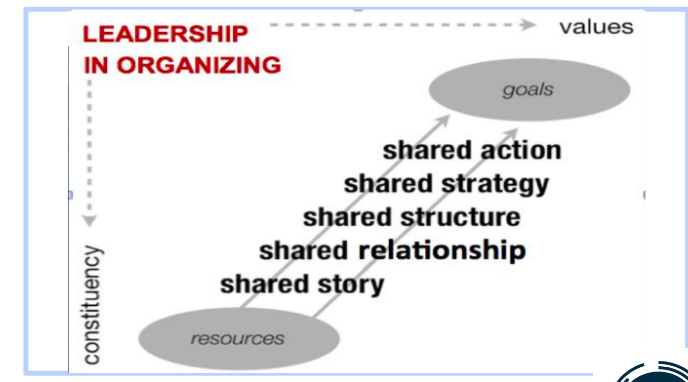

### Leadership and Organization

## Lecture 1: Leading Change
Empowerment of a person begins with taking responsibility.
Empowerment of a community begins with commitment.
Responsibility begins with choosing to act.

Leadership: Accepting responsibility for enabling others to achieve purpose under conditions of uncertainty.
Condition of uncertainty here means knowing what needs to be done and how to perform it well.

Every great leaders in the face of uncertainty have 3 different factors working to solve it.

Hands: What to learn
What skills do I have, or that should I acquire to tackle this problem.

Head: What to use
Having a vision to see the outcome to solving this problem. To devise ways to use the skills/resources that are available to me to achieve my goals.

Heart: Courage/perseverance
Having courage and grit to see the project through tough times. Having enough passion for hopefulness and forbearance to act.

A good leader will instantiate tackling a problem by asking following questions:
1. Who are my people? Who am I representing?
2. What are their urgent problems?
3. How can I help them turn their resources into the power to solve their problem?

## People have the power to bring change

Great leaders have a motivating narrative to construct a story-- why they must act-- and imagining how they can act-- their strategy.

1. Start with a compelling story.
2. Build a community that believes in the story. Create a shared relationship.
3. Create a structure/leadership team from the community. Delegate and divide roles.
4. Create a strategy, learn how to turn resources they have into the power they need to get what they want.
5. Take action.

Strategy should be adapted and developed as per the influence of other parameters. Good strategy helps in increasing commitments that builds more relationship and helps drive the project on a long run.

## The different between organized and disorganized team is
| disorganized | leadership            | organized   |
|--------------|-----------------------|-------------|
| passive      | shared story          | active      |
| divided      | relational commitment | united      |
| drift        | clear structure       | purpose     |
| reactive     | clear strategy        | initiative  |
| demobilized  | effective action      | mobilized   |

